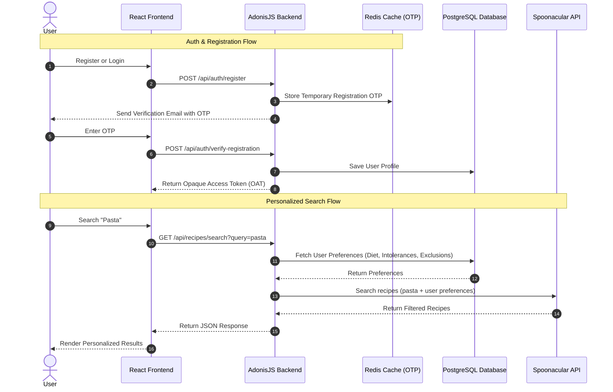

# Recipe Hub 🍳

Recipe Hub is a full-stack, responsive web application for recipe discovery, saving, and dietary personalization. Built with a highly modular and modern architecture, it features a **React 19** frontend powered by Vite and Zustand, and an **AdonisJS v6** (TypeScript) backend supported by Lucid ORM, PostgreSQL, Redis, and Opaque Access Token (OAT) authentication.

The core differentiator of Recipe Hub is its **Smart Dietary Profile Integration**—the search interface automatically and transparently integrates user-configured preferences (cuisines, diets, intolerances, and excluded ingredients) into recipe discovery queries fetched from the external **Spoonacular Food API**.

---

## 🚀 Key Features

*   **Smart Recipe Personalization:** Transparently filters searches based on user-configured preferences (e.g., Vegetarian, Gluten-Free, Nut Allergies, or excluded ingredients).
*   **Dual Auth System:** Local registration & login backed by one-time password (OTP) verification emails via SMTP/Redis, alongside fully integrated **Google OAuth2** authentication.
*   **Token-Based Security:** Secure and stateless session management using **Opaque Access Tokens (OAT)** via AdonisJS Shield.
*   **Interactive Favorites & Preferences:** Users can save their favorite recipes, manage custom profile settings, and dynamically adjust meal plans or dietary constraints.
*   **Premium UI/UX:** Styled using **Tailwind CSS**, featuring rich page layouts, micro-animations by **Framer Motion**, dynamic avatars, and interactive search filters.
*   **Containerized Development:** Ready-to-use Docker environment for local PostgreSQL and Redis databases.

---

## 🏗️ Architecture & Flow

The application is structured as a client-server architecture. The frontend runs client-side SPA routing and communicates with the AdonisJS backend API.



---

## 🛠️ Technology Stack

### Frontend
*   **Core:** React 19, TypeScript, HTML5
*   **Build Tool:** Vite 8
*   **State Management:** Zustand 5 (for global authentication & configuration store)
*   **Routing:** React Router Dom v7
*   **Styling:** Tailwind CSS v3
*   **Animations:** Framer Motion v12
*   **HTTP Client:** Axios (configured with interceptors for automatic token headers)

### Backend
*   **Framework:** AdonisJS v6 (TypeScript core)
*   **ORM:** Lucid ORM
*   **Authentication:** AdonisJS Auth (Opaque Access Tokens guard) & `@adonisjs/ally` (Google Social Auth)
*   **Validation:** VineJS
*   **Caching & Queue (OTP):** Redis
*   **Database:** PostgreSQL (Production) / SQLite (Test environment support)
*   **Mailing:** Nodemailer (SMTP service config)
*   **Testing:** Japa Runner & Assert packages

### Services & API Integration
*   **Recipe Provider:** Spoonacular Food API
*   **Deployment Platforms:** Vercel (Frontend SPA) and Render/VPS (Backend Web Service)

---

## 📁 Directory Structure

```text
RECIPIE_HUB/
│
├── backend/                  # AdonisJS Backend
│   ├── .adonisjs/            # AdonisJS compiler artifacts
│   ├── app/                  # Application Logic
│   │   ├── constants/        # Centralized route strings and response constants
│   │   ├── controllers/      # Route controllers (Auth, Recipes, Favorites, etc.)
│   │   ├── dtos/             # Data Transfer Objects
│   │   ├── enums/            # Shared Enums (HttpStatus, etc.)
│   │   ├── exceptions/       # Custom Exception Handlers
│   │   ├── interfaces/       # Service contract interfaces
│   │   ├── middleware/       # Auth guards, CORS, and Session middleware
│   │   ├── models/           # Lucid Database Models
│   │   ├── services/         # Business logic layer (Spoonacular, Preferences)
│   │   ├── validators/       # Input validation schemas (VineJS)
│   │   └── utils/            # Helper utilities
│   ├── bin/                  # Node executable scripts
│   ├── config/               # Database, Auth, Mail, and Redis configs
│   ├── database/             # Migrations & schema definitions
│   ├── start/                # Server boot files, routes.ts, and kernel.ts
│   ├── tests/                # Japa Integration and Unit tests
│   └── package.json          # Backend dependencies and scripts
│
├── frontend/                 # React SPA Frontend
│   ├── public/               # Static assets & favicon
│   ├── src/                  # React Application
│   │   ├── assets/           # Visual and media assets
│   │   ├── components/       # Reusable layout and custom UI components
│   │   ├── hooks/            # Custom React Hooks
│   │   ├── layouts/          # Page layout shells (RootLayout, AuthLayout)
│   │   ├── pages/            # Core views (Search, Profile, Login, Details)
│   │   ├── services/         # API service classes (axios endpoints wrapper)
│   │   ├── store/            # Zustand global stores (authStore)
│   │   └── types/            # TypeScript type declarations
│   ├── tailwind.config.js    # Tailwind configuration
│   ├── vite.config.js        # Vite compilation rules
│   └── package.json          # Frontend dependencies and scripts
│
├── docker-compose.yml        # Development services setup (Postgres + Redis)
└── vercel.json               # Vercel Monorepo build routing
```

---

## 🗄️ Database Schema & Models

### Core Models

1.  **User (`users` table)**
    *   `id` (Primary Key, Incremental)
    *   `name` (String, Optional)
    *   `email` (String, Unique)
    *   `password` (String, Hashed)
    *   `googleId` (String, Optional, for OAuth users)
    *   `avatarUrl` (String, Optional, local/external URL)
    *   `isVerified` (Boolean, defaults to false)
    *   `createdAt` & `updatedAt` (Timestamps)

2.  **UserPreference (`user_preferences` table)**
    *   `id` (Primary Key)
    *   `userId` (Foreign Key -> `users.id` ON DELETE CASCADE)
    *   `cuisines` (JSON/Text, array of preferred cuisines)
    *   `diet` (String, diet category: vegan, keto, vegetarian, etc.)
    *   `intolerances` (JSON/Text, list of food allergies/intolerances)
    *   `includeIngredients` (JSON/Text)
    *   `excludeIngredients` (JSON/Text)
    *   `type` (String, preferred meal type)
    *   `maxReadyTime` (Integer, maximum recipe preparation duration)

3.  **FavoriteRecipe (`favorite_recipes` table)**
    *   `id` (Primary Key)
    *   `userId` (Foreign Key -> `users.id` ON DELETE CASCADE)
    *   `recipeId` (Integer, Spoonacular recipe ID)
    *   `title` (String, Cached recipe title)
    *   `image` (String, Cached recipe thumbnail URL)

4.  **AccessToken (`auth_access_tokens` table)**
    *   `id` (Primary Key)
    *   `tokenable_id` (Foreign Key -> `users.id`)
    *   `type` (OAT type marker)
    *   `name` (Token description)
    *   `hash` (Hashed value of the secure token string)
    *   `last_used_at` & `created_at` & `expires_at` (Timestamps)

---

## ⚙️ Environment Variables

### Backend Configuration (`backend/.env`)

Copy the template file to `.env` and fill in the values:

```bash
cp backend/.env.example backend/.env
```

Key environment properties:

```ini
# Server Details
TZ=UTC
PORT=3333
HOST=localhost
NODE_ENV=development
APP_KEY=YOUR_ADONIS_APP_KEY   # Generated using: node ace generate:key
APP_URL=http://localhost:3333

# Frontend Redirection Target
FRONTEND_URL=http://localhost:5173

# Database configuration (Matches docker-compose environment)
DB_HOST=127.0.0.1
DB_PORT=5432
DB_USER=postgres
DB_PASSWORD=postgres
DB_DATABASE=recipe_hub

# Redis Cache (OTP validation)
REDIS_HOST=127.0.0.1
REDIS_PORT=6379
REDIS_PASSWORD=

# Social Login API
GOOGLE_CLIENT_ID=your_google_client_id.apps.googleusercontent.com
GOOGLE_CLIENT_SECRET=your_google_client_secret

# Spoonacular API Credentials
SPOONACULAR_API_KEY=your_spoonacular_api_key

# SMTP configuration for OTP Verification (e.g. Gmail App Password)
SMTP_HOST=smtp.gmail.com
SMTP_PORT=587
SMTP_USER=your_email@gmail.com
SMTP_PASSWORD=your_app_password
SMTP_SECURE=false
MAIL_FROM="Recipe Hub <your_email@gmail.com>"
```

### Frontend Configuration (`frontend/.env`)

```ini
VITE_API_URL=http://localhost:3333/api
```

---

## 🛠️ Installation & Setup

### Prerequisites

Ensure you have the following installed on your machine:
*   [Node.js](https://nodejs.org/) (v20+ recommended)
*   [Docker Desktop](https://www.docker.com/products/docker-desktop/) (for local Postgres/Redis infrastructure)
*   [Git](https://git-scm.com/)

---

### Step 1: Run Local Databases (Docker)

Spin up the preconfigured PostgreSQL and Redis servers defined in `docker-compose.yml` at the project root:

```bash
docker-compose up -d
```

This starts:
*   **PostgreSQL** database on port `5432`
*   **Redis** database on port `6379`

---

### Step 2: Configure & Run Backend

1.  Navigate to the backend directory:
    ```bash
    cd backend
    ```
2.  Install dependencies:
    ```bash
    npm install
    ```
3.  Set up environment variable values (refer to [Environment Variables](#backend-configuration-backendenv)):
    ```bash
    cp .env.example .env
    ```
4.  Generate your unique AdonisJS secret app key:
    ```bash
    node ace generate:key
    ```
5.  Execute database migrations to prepare the schemas:
    ```bash
    node ace migration:run
    ```
6.  Start the Adonis development server:
    ```bash
    npm run dev
    ```

The API is now running locally at `http://localhost:3333`.

---

### Step 3: Configure & Run Frontend

1.  Navigate to the frontend directory:
    ```bash
    cd ../frontend
    ```
2.  Install dependencies:
    ```bash
    npm install
    ```
3.  Create the client env file:
    ```bash
    cp .env.example .env
    ```
4.  Launch the Vite dev server:
    ```bash
    npm run dev
    ```

The frontend client is now live at `http://localhost:5173`. Open it in your browser!

---

## 🔌 API Documentation

All routes are prefixed with `/api`. Below are the primary endpoints:

### 🔑 Authentication Routes (`/api/auth`)

| Method | Endpoint | Auth | Description |
| :--- | :--- | :--- | :--- |
| `POST` | `/register` | No | Registers user, generates email OTP verification |
| `POST` | `/verify-registration` | No | Verifies verification OTP and sets user as active |
| `POST` | `/resend-otp` | No | Resends OTP email for verification or password reset |
| `POST` | `/login` | No | Authenticates local user, returns Opaque Access Token |
| `POST` | `/forgot-password` | No | Requests OTP for resetting password |
| `POST` | `/verify-otp` | No | Validates whether the recovery OTP is valid |
| `POST` | `/reset-password` | No | Resets account password using valid OTP verification |
| `GET` | `/google` | No | Redirects the client to Google OAuth Consent Page |
| `GET` | `/google/callback` | No | Receives OAuth code, checks database and logs in |
| `GET` | `/me` | Yes | Retrieves authenticated user profile details |
| `POST` | `/logout` | Yes | Revokes the current Opaque Access Token |

### 🥗 Recipes & Favorites Routes (`/api/recipes`)

| Method | Endpoint | Auth | Description |
| :--- | :--- | :--- | :--- |
| `GET` | `/search` | Optional | Queries recipes from Spoonacular, merging profile preferences if auth'd |
| `GET` | `/:id` | No | Retrieves detailed ingredients, steps, and recipe metadata |
| `GET` | `/favorites` | Yes | Lists favorited recipes of the logged-in user |
| `GET` | `/favorites/ids` | Yes | Gets only IDs of favorites (for frontend toggle states) |
| `POST` | `/favorites/toggle` | Yes | Saves or removes a recipe from the user's favorites list |

### ⚙️ User Settings & Preferences (`/api/user`)

| Method | Endpoint | Auth | Description |
| :--- | :--- | :--- | :--- |
| `GET` | `/preferences` | Yes | Fetches user's dietary preferences configuration |
| `PUT` | `/preferences` | Yes | Updates user's dietary, cuisine, intolerance, and exclusion lists |
| `POST` | `/avatar` | Yes | Uploads and registers a new profile avatar image |
| `POST` | `/change-password` | Yes | Changes user's login password |

---

## 🧪 Testing

The backend is configured with [Japa](https://japa.dev/) for unit and integration testing.

To run the backend test suite:

```bash
cd backend
npm run test
```

This runs the database tests using the `.env.test` configuration (which uses an in-memory or separate file-based SQLite database to ensure tests do not pollute your development PostgreSQL database).

---

## ☁️ Deployment

### Frontend (Vercel)
The React frontend is optimized for zero-config Vercel deployment. Since client-side routing is managed by React Router, the `frontend/vercel.json` file handles routing rewrites to prevent 404 errors on browser page reloads:
```json
{
  "rewrites": [
    { "source": "/(.*)", "destination": "/index.html" }
  ]
}
```
1. Import your repository on Vercel.
2. Select the `frontend` folder as the root directory.
3. Configure the `VITE_API_URL` environment variable pointing to your deployed backend.

### Backend (Render / VPS)
AdonisJS can be deployed to Render as a Web Service or any Linux VPS using Docker/PM2.
1. Build the production build using:
   ```bash
   node ace build
   ```
2. Run database migrations on deployment:
   ```bash
   node ace migration:run --force
   ```
3. Set the environment variables in your hosting provider's dashboard. Remember to generate a production-ready `APP_KEY`.
